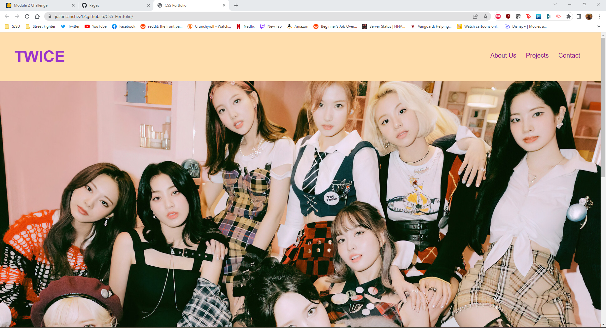

# 02-Portfolio

## Objective
The objective of this project is to create a portfolio utilizing advance CSS and html methods. For this portfolio three tags are made, which are "About", "Projects", and "Contact". These tags will have headers labeled on the top right of the page and they would have an anchor link so by clicking on the link it would direct you to the section.

Also, this portfolio will be made so that the user can read the portfolio on any screen due to "resizing". 

